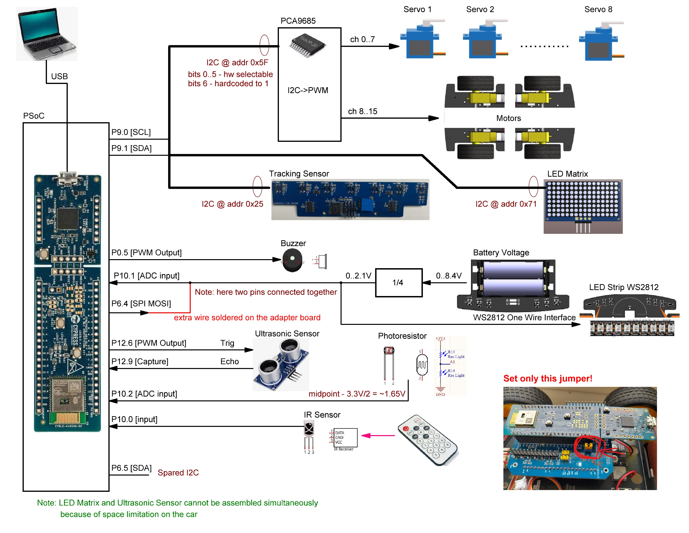

# API user manual for Hackathon self-driving Car

If you want to see all APIs available for usage, you just need to check corresponding `.c` and `.h` files.
Each of them contains self-explanatory documentation, how this API should be used, which data types it supports etc.

This documentation will explain it more like "user manual", namely, when you would like to use something, what are possible use cases, how can you modify a function you wish and what is the high-level idea of a particular module.

# General description

This car is built on PSoC 63 Dual-Core kit. For simplisity purposes, no RTOS is included in project. Instead, both CM0+ and CM4 cores are utilized for different purposes.

CM0+ core is utilized soley for BLE functionality. It is used to run BLE Host, event system, connection process etc.

CM4 core is used for a main application flow. You would like to write all your car-related logic for this exact core. Only refer to CM0+ if you would like to add some BLE functionality.

CM0+ and CM4 cores are communicating via IPC Pipe mechanism. Linux users may already recognize it. Concept is very similar. There are two unidirectional pipes from one core to other, sending bytestream to opposite core.

# Hardware Connection and PSoC Pins Assignment

Figure below shows how different hardware (HW) parts of the car are connected to PSoC6 and some hints.

To see how these pins are connected to internal HW components of PSoC you can open TopDesign.cysch file in PSoC Creator project.

Key HW components needed for this project:
- The wheels are controlled using I2C to PWM converter based on PCA9685.
- Tracking sensor connected to the same I2C bus, but uses different address.
- LED strip is driven using SPI MOSI on P6.4, but at the same time it is connected to P10.1 and battery voltage devider. P10.1 is ADC input. So, challange is to use common wire for LED strip control and measuring of battery voltage.

Other HW components are optional in this project.

Please note, that we provide all the necessary APIs to control mentioned HW, you do not need to develop them from sketch. Description of such APIs is provided in the following chapters.

Please also ensure that only single jumper on the adapter board is set (see yellow jumper in the figure above).

Do not forget to push power on button on the car chassis, otherwise it will not drive even your program is correct :-).

# Modules description

## Debug

This is a pretty simple module. It is created to log an application behavior with the possibility to disable all the logs using just one macro. Log commands may stay in the code.

### Usage

There are two file sets for debugging for each core. These are: `debug.c` and `debug.h` for CM0+ core and `debug_cm4.c` and `debug_cm4.h` for CM4 core.

To enable the debugging, just go to corresponding `header` file and change the define `DEBUG_UART_ENABLED` to `1`.

After that, just use any APIs you want. Most probably you would like to use a `DBG_PRINTF` since this is a direct wrapper of `printf` function.

**NOTE: Only one UART is used for debugging! There is no sync mechanism to allow them working in parallel. If you want to have good expected results, please have debug enabled only on one core at the time. Otherwise there is no warranty that it would work properly.**

## Ledctrl

This is a little module to control WS2812b address leds available on the car. API is kept minimal, almost bare-bone, to have maximal level of performance. You're very welcome to expand the functionality if needed.

For WS2812b driving, SPI component is utilized. This is a pretty well known trick, related to how WS2812b protocol functions in general.
You can read more about this, for example, here:

- https://controllerstech.com/ws2812-leds-using-spi/
- https://www.elektroda.com/news/news4111570.html
- https://ensaltun.medium.com/driving-ws2812b-by-nuvoton-m031-series-spi-ef32997f2183

This should give you clear understanding of the method we are using here.

### Usage

**Module is accessible only from CM4 core.**

Method of driving is as follows: You edit data buffer called `Leds_rawColorBuffer` as you wish, and then you just send it completely on the LED strip. There is no way to send a separate pixel because of WS2812b protocol, so in any case we need to send the whole data package.

`Leds_rawColorBuffer` is dependent on `WS2812_BUFFER_SIZE` variable, which is calculated in compile-time. It is already configured for the car, but in case you want to tinker with the values, you can refer to `WS2812_LED_QTY` define.

First of all, you would like to call `Leds_Init()` function to correctly initialize the SPI component. It returns the error status, but you can discard it if you want.

After that, use the following APIs: `Leds_PutPixel()`, `Leds_FillSolidColor()` to modify the buffer contents. Those are protected from unintended input and recommended for the usage. First API allows you to change one pixel color, second API allows you to easily fill the whole strip with the desired color.

Finally, call `Leds_Update()` to display your buffer onto a strip.

### Useful tricks

- `Leds_rawColorBuffer` is `extern` to header file. Despite it is not recommended, if you have a strong programmer urge, you can fiddle with the buffer directly.

- There is a `ledColor` structure defined but not used, if you want to have some pretty storage format for pixels, you can utilize that or just use APIs as provided.

## IPC

Interprocess communitcation works Linux Pipe way there. Nothing especially fancy.

First of all, check `ipc_def.h`, this is a shared file for all cores. It contains all definitions needed. Most interesting are `ipc_msg_t`, this is our message we are going to send and receive. You can just send pure bytes, but proper serialization is always a good choice! *Note: All of those structure fields are custom made, you can change them and utilize as you want. For example, there is no hardware need CM0+ to CM4 message to be marked as `IPC_CM0_TO_CM4_CLIENT_ID` but we did this to have clearer understanding. You better follow this rule to not have problems with code in the future.*

### Usage

IPC exists in two copies for each core. Those are `cm0_ipc.c`, `cm0_ipc.h` for CM0+ and `cm4_ipc.c`, `cm4_ipc.h` for CM4. Basically, those are almost mirrored set of functions.

Normally, this communication works the next way:

- For corresponding core, `Cy_IPC_Pipe_RegisterCallback()` is used to have the possibility to receive messages from an other core. Do it for both cores. `cmX_ipc.h` already contains functions named `CMX_MessageCallback`, where `X` is your core name.
- In superloop, `CMX_isDataAvailableFromCMY` can be used to check new messages availability, where `X` is your core, and `Y` is the opposite core.
- If message is present, `CMX_GetCMYMessage` can be used to read it. Also it marks the message as already read, so `CMX_isDataAvailableFromCMY` will start returning `false` after that.
- In order to send a message, `ipc_msg_t` should be created and filled properly. After that, `CMX_SendCMYMessage` should be called.
- You can use `CMX_IsCMYReady` or `CMX_ReleaseCallback` to check whether message is received on the other side.

### Useful notes

May sound hard, but such communication is already implemented in `main_cm4.c` and `ble_nus_subsys`, go check those out and you will see that in general, it works real simple. Hard part is to properly create your own protocol which would seamlessly connect two cores.

We have already implemented such a basic functionality to pass BLE messages from CM0+ to CM4 and send some commands back from CM4 to CM0+. You can check those out.

## BLE NUS Subsystem

This system enables a UART via BLE 5.0 functionality. It uses a `Nordic UART Service` + RX/TX Characteristics to allow duplex communication with other NUS-UART enabled devices. Read more about it [here](https://docs.nordicsemi.com/bundle/ncs-latest/page/nrf/libraries/bluetooth/services/nus.html).

The whole subsystem is two files `ble_nus_subsys.c` and `ble_nus_subsys.h`.

All the BLE-related functionality is serviced solely on CM0+ core. Also, CM0+ core can notify CM4 core about new events, and it can receive messages from CM4 core to transmit them via NUS. For such functionality, [IPC is used](#ipc).

### Command system

This module incorporates a simple command system. Here is how it works:

- `cm0_cm4_shared_cmd.h` contains enumeration for commands each core should know about. Currently there are only CM0+ shared commands for CM4 to know them.
- `ble_nus_subsys.h` contains commands you can send to CM0+ core from, say, mobile phone or BLE 5.0-enable PC.

For examples, we have some commands already implemented for CM0+ and CM4. For simplicity, command identifier is just a [0] byte of payload.
For CM0+ those are:

- `BLE_NUS_PAYLOAD_CM0_CMD` - Means this command is intended solely for CM0+ core. Maybe you want to have some configurations here or something, that should never affect CM4.
- `BLE_NUS_PAYLOAD_CM4_CMD` - Means you want to just pass thru this command to CM4 core. Byte [0] would be removed by CM0+ command parsers. This is mostly what you want to use 90% of the time because main application runs on CM4 core.

Example, if you send such a bytestream: `{BLE_NUS_PAYLOAD_CM4_CMD, 0x01, 0x02, 0x03}`, CM4 core will receive a `{0x01, 0x02, 0x03}` payload.

For CM4 we have following commands as an example + starting point:

- `CM4_COMMAND_LED_ENA` - enable green LED on board.
- `CM4_COMMAND_LED_DIS` - disable green LED on board.
- `CM4_COMMAND_CAR_SAY` - if Central device is currently subscribed to notifications, car will send `Wroom!` string back to it.
- `CM4_COMMAND_ECHO` - if Central device is currently subscribed to notifications, car will echo whatever you have sent to it.

Example: if you send such a payload: `{BLE_NUS_PAYLOAD_CM4_CMD, CM4_COMMAND_LED_ENA}`, or `{0x02, 0x01}`, the green LED will turn on.

Also, CM4 can ask CM0+ perform tasks, as was described earlier. Such mechanism is used to execute commands such as CAR_SAY or ECHO.
When CM4 receives such a command, it prepares an IPC message for CM0+ core. It is being parsed via `processIncomingIPCMessage` and after that, `processCM0Command` if signature is correct.

Example, if you send `{BLE_NUS_PAYLOAD_CM4_CMD, CM4_COMMAND_ECHO, 'H', 'e', 'l', 'l', 'o'}`, the car would notify you `Hello` in a corresponding characteristic (be sure you have subscribed to it!).

For the CM4 to CM0+ IPC, there are several commands implemented:

- `CM0_SHARED_BLE_NTF_RELAY` - Just pass bytes to notification.
- `CM0_SHARED_CAR_SAY` - Write `Wroom!` to notification.

### Usage

First of all, initialize the subsystem with `BleNUSInit`.

In while loop, you absolutely must use `Cy_BLE_ProcessEvents()` to process any incoming events.

`AppCallBack()` is a good place to check what is going on in BLE stack! It is a generic callback for any events passing via BLE 5.0. Check what's inside, you'll find some interesting events like `CY_BLE_EVT_STACK_ON`, `CY_BLE_EVT_GAP_DEVICE_DISCONNECTED` and especially `CY_BLE_EVT_GATTS_WRITE_REQ`. This is the main event when the Central writes to our Car. We want to handle it properly!

`parseIncomingBLECommand` is a parser for all commands sent via BLE 5.0 to CM0+ core.

`sendDataNotificationNUS` is used to notify subscribed Central with any data you want.

`processCM0Command` is used to process IPC (not BLE) messages from CM4 core.

## Motor Control Subsystem

Motor control subsystem is minimalistic and contains two API:

- `Motor_Init()` prepares motor subsystem and shall be called at start of program code.
- `Motor_Move(int m1_speed, int m2_speed, int m3_speed, int m4_speed)` allows to define speed of each wheel of car. Positive number defines direct rotation while negative number grants reverse rotation. Minimal allowed speed value is -4095 (maximal speed in reverse direction) and maximal wheel speed value is 4095. Set speed to 0 to stop motor. When speed is set motor will execute rotation at given speed until different speed value is provided by the another call of `Motor_Move(...)` API.

## Sound Subsystem

Allows to generate audible output using onboard buzzer.
- `Sound_Init()` prepares sound subsystem and shall be called at start of program code.
- `Sound_WriteTone(uint32_t freq)` set buzzer to output tone with given frequency. After exit of this API buzzer will continue to generate tone until different tone is requested by another call of `Sound_WriteTone(...)`. Call `Sound_WriteTone(0)` to stop produce tone when applicable.
- `Sound_Play(uint32_t freq, uint32_t duration)` allows to play tone with desired frequency for a given given duration.

## Track Sensor Subsystem

Controls optical track sensor to detect line on the track. Car is using 7-element track sensor.

- `Track_Init()` prepares track sensor subsystem and shall be called at start of program code.
- `uint8_t Track_Read()` read one byte with state of 7-element sensor. Each bit correspond to one optical sensor. MSB is always zero. E.g. 00000001b (0x01) means that one side sensor detects line. 00001000b (0x80) means that central sensor detects line, 01111111 (0x7F) means that all 7 sensors detects line.

## Timing Subsystem

Allows to measure milliseconds spent from chip boot. Can be used to define time reference for a design with non-blocking API call

- `Timing_Init()` prepares timing subsystem and shall be called at start of program code.
- `uint32_t Timing_GetMillisecongs(void)` read 32-bit value with milliseconds spent from start of the code execution. 
-  Another routine related with time is `CyDelay(uint32_t milliseconds)` - it allows to perform blocking delay, API will return control after defined time.